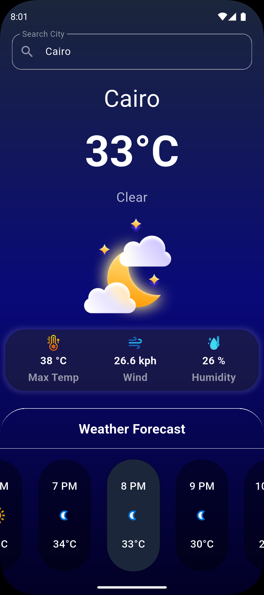
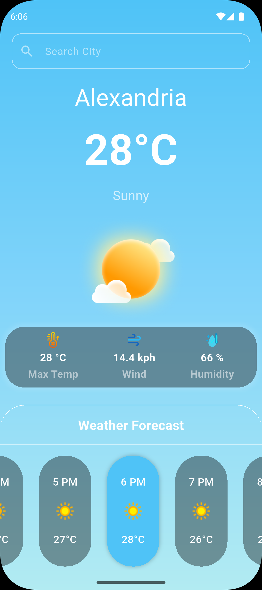
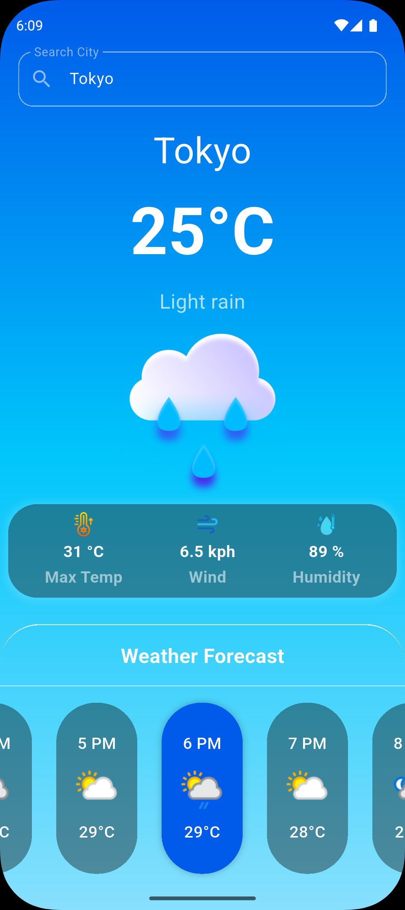
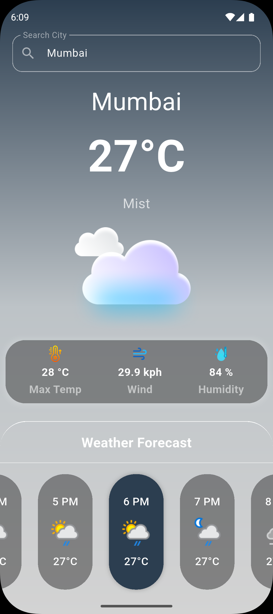
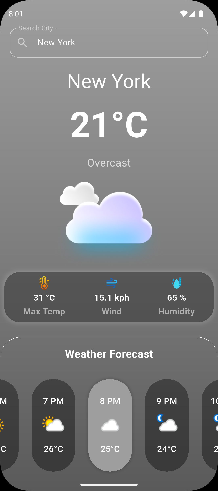

# 🌦️ Weather App Plus

Weather App Plus is a simple and clean Flutter application that displays real-time weather information using the WeatherAPI. It features current conditions, forecasts, dynamic UI updates based on weather, and automatic location fetching.

---

## 📸 Screenshots (from actual app UI)

| Clear | Sunny | Rain | Mist | Overcast |
|:-----:|:-----:|:----:|:----:|:--------:|
|  |  |  |  |  |

---

## ✨ Features

- 🌍 **Auto location detection** (with fallback if denied)
- 🔍 **Search functionality** to find weather information by city name
- 🎨 **Dynamic gradients** based on weather condition
- 🌤️ **Custom weather icons** for day and night
- 📊 **Hourly forecast** in a responsive horizontal list
- 💧 Max temperature, wind speed, and humidity overview
- ⏳ **Animated loading indicator** with subtle effects
- 📱 Fully **responsive UI** using `MediaQuery` extensions
- 🧠 Clean architecture using **BLoC pattern**
- ⚡ Powered by **[WeatherAPI.com](https://www.weatherapi.com/)**

---

## 🚀 Getting Started

### 1. Clone the repository
```bash
git clone https://github.com/your-username/weather_app_plus.git
cd weather_app_plus
```

### 2. Install dependencies
```bash
flutter pub get
```

### 3. Add your WeatherAPI key  
Create a new file at:
```
lib/secrets.dart
```

Add the following content (replace with your actual key):
```dart
const String weatherApiKey = 'YOUR_API_KEY_HERE';
```

> ⚠️ `lib/secrets.dart` is ignored in `.gitignore` and must be added manually.

Get your API key from [WeatherAPI.com](https://www.weatherapi.com/).

---

## 📂 Project Structure

```
weather_app/
├── lib/
│   ├── cubits/                 # BLoC cubit + states
│   ├── extensions/             # MediaQuery-based sizing
│   ├── models/                 # Weather data models
│   ├── services/               # Weather API service
│   ├── utils/                  # Gradients, themes, icons
│   ├── views/                  # Screens (HomeView)
│   ├── widgets/                # Reusable UI components
│   └── main.dart               # Entry point
├── assets/                     # Weather icons
├── screenshots/                # Screenshots for preview
└── pubspec.yaml
```

---

## 🧪 Packages Used

- [`flutter_bloc`](https://pub.dev/packages/flutter_bloc)
- [`dio`](https://pub.dev/packages/dio)
- [`geolocator`](https://pub.dev/packages/geolocator)
- [`geocoding`](https://pub.dev/packages/geocoding)
- [`animated_text_kit`](https://pub.dev/packages/animated_text_kit)

---

## 🤝 Contributing

This project is a demo and not intended for production.  
Feel free to fork or use as a reference for learning state management and weather APIs in Flutter.

---

## 👤 Author

Built with ❤️ by **Muhammed Ibrahem**
